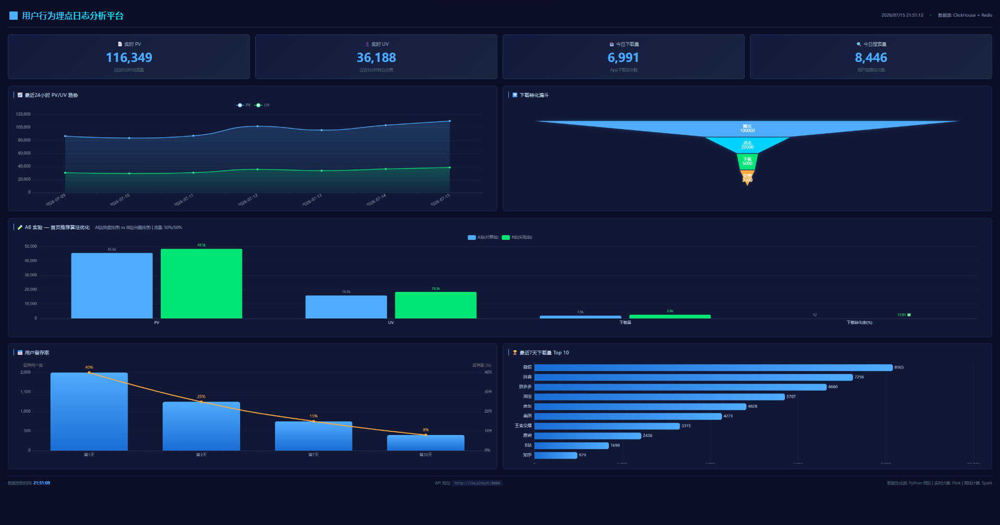
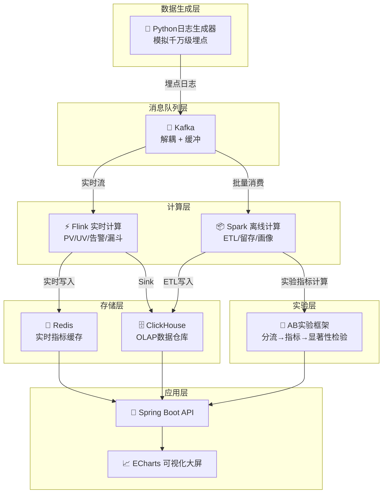
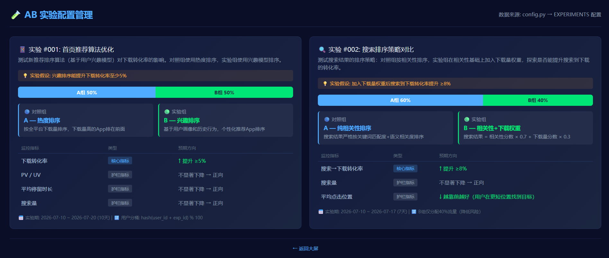

# 📊 用户行为埋点日志分析平台

> **User Behavior Analytics Platform** — 从零构建的实时+离线大数据分析系统

[](https://www.oracle.com/java/)
[](https://www.python.org/)
[](https://www.scala-lang.org/)
[](https://flink.apache.org/)
[](https://spark.apache.org/)
[](https://kafka.apache.org/)
[](https://clickhouse.com/)
[](LICENSE)

---

## 🎯 项目简介

模拟**千万级移动App埋点日志**，构建完整的**实时流处理 + 离线批处理**大数据分析管道。

适用场景：应用商店用户行为分析、广告转化漏斗、用户留存分析、实时业务监控大屏。

```
📱 App埋点日志 → Kafka → Flink(实时) → Redis(实时指标) → Dashboard大屏
                       → Spark(离线) → ClickHouse(数据仓库) → BI报表
```

## 🖥️ 预览



---

## 🏗️ 系统架构



---

## 🛠️ 技术栈

| 层级 | 技术组件 | 版本 | 用途 |
|------|---------|------|------|
| **数据生成** | Python + Faker | 3.10+ | 模拟千万级App埋点日志 |
| **消息队列** | Apache Kafka | 3.5 | 日志缓冲与解耦 |
| **实时计算** | Apache Flink (Java) | 1.17 | 实时PV/UV、漏斗、异常检测 |
| **离线计算** | Apache Spark (Scala) | 3.4 | 天级ETL、留存计算、用户画像 |
| **OLAP引擎** | ClickHouse | 23.8 | 海量日志快速聚合分析 |
| **实时缓存** | Redis | 7.2 | 实时指标缓存与查询 |
| **API服务** | Spring Boot | 3.x | RESTful API |
| **可视化** | ECharts | 5.x | 实时大屏 + 数据分析面板 |
| **部署** | Docker Compose | 3.8 | 一键启动全部基础设施 |

---

## 📁 项目结构

```
user-behavior-analytics-platform/
├── docker/                         # 🐳 Docker 基础设施编排
│   ├── docker-compose.yml          #    一键启动 Kafka/ClickHouse/Redis
│   ├── kafka/
│   │   └── init-topics.sh          #    Kafka Topic 自动创建脚本
│   └── clickhouse/
│       └── init-tables.sql         #    ClickHouse 建表SQL
│
├── src/
│   ├── generator/                  # 🐍 Python 日志生成器
│   │   ├── config.py               #    配置（事件比例、设备型号库）
│   │   ├── models.py               #    数据模型定义
│   │   ├── event_factory.py        #    事件工厂（随机生成埋点）
│   │   ├── kafka_producer.py       #    Kafka 生产者
│   │   ├── significance_test.py   #     AB实验显著性检验
│   │   └── main.py                 #    入口程序
│   │
│   ├── flink_jobs/                 # ⚡ Flink 实时计算作业 (Java)
│   │   ├── pom.xml                 #    Maven 依赖配置
│   │   └── src/main/java/com/analytics/
│   │       ├── model/              #    数据模型
│   │       ├── source/             #    Kafka 数据源连接
│   │       ├── process/            #    核心处理函数
│   │       │   ├── RealtimePVUV.java       #  实时PV/UV
│   │       │   ├── DownloadStats.java      #  实时下载统计
│   │       │   ├── FunnelAnalysis.java     #  实时漏斗
│   │       │   └── AnomalyDetector.java    #  异常检测告警
│   │       └── sink/               #    数据写出 (ClickHouse/Redis)
│   │
│   ├── spark_jobs/                 # 📦 Spark 离线计算作业 (Scala)
│   │   ├── pom.xml                 #    Maven 依赖配置
│   │   └── src/main/scala/com/analytics/
│   │       ├── etl/                #    ETL 数据清洗
│   │       └── metrics/            #    指标计算 (留存/漏斗/画像/AB实验)
│   │
│   ├── warehouse/                  # 🗄️ 数据仓库 SQL
│   │   ├── hql/                    #    Hive/SparkSQL 分层建表
│   │   └── docs/                   #    数仓设计文档
│   │
│   ├── api/                        # 🔧 Spring Boot API
│   │   └── src/main/java/com/analytics/
│   │       ├── controller/         #    REST 接口
│   │       ├── service/            #    业务逻辑层
│   │       └── config/             #    数据源配置
│   │
│   └── dashboard/                  # 📈 数据可视化面板
│       ├── index.html              #    大屏主页面
│       ├── ab-config.html          #    AB实验配置管理
│       ├── css/                    #    样式
│       └── js/                     #    图表逻辑 (ECharts)
│
├── data/                           # 📊 本地测试数据
├── notebooks/                      # 📓 Jupyter 分析笔记本
├── tests/                          # 🧪 测试代码
└── docs/                           # 📖 文档
    ├── architecture.md             #    架构设计文档
    ├── data-model.md               #    数据模型设计
    ├── api-spec.md                 #    API 接口文档
    └── deployment.md               #    部署文档
```

---

## 🚀 快速开始

### 前置要求

- **Docker Desktop** ≥ 4.x（已安装并运行）
- **Java JDK** ≥ 17
- **Python** ≥ 3.10
- **Maven** ≥ 3.8

### 1. 启动基础设施

```bash
cd docker
docker-compose up -d
```

启动后验证各服务状态：

```bash
docker-compose ps                    # 确认所有服务都是 Up 状态
docker-compose logs kafka-init       # 确认 Kafka Topic 创建成功
```

### 2. 启动日志生成器

```bash
cd src/generator
pip install -r requirements.txt

# 生成日志到 Kafka（每分钟1万条，持续1小时）
python main.py --rate 10000 --duration 3600 --output kafka

# 或者生成到本地JSON文件（方便调试）
python main.py --rate 1000 --duration 60 --output file
```

### 3. 启动 Flink 实时作业

```bash
cd src/flink_jobs
mvn clean package -DskipTests

# 提交到本地 Flink 集群
flink run target/flink-jobs-1.0.jar
```

### 4. 启动 API 服务

```bash
cd src/api
mvn spring-boot:run
```

访问 http://localhost:8080/swagger-ui.html 查看 API 文档。

### 5. 打开 Dashboard

直接用浏览器打开 `src/dashboard/index.html`，或者：

```bash
cd src/dashboard
python -m http.server 3000
# 访问 http://localhost:3000
```

---

## 📋 核心功能

### 实时指标
- ✅ **实时 PV/UV** — 5秒粒度滑动窗口
- ✅ **实时下载量** — 按App细分维度统计
- ✅ **异常检测告警** — CEP模式匹配，下载突降/突增感知
- ✅ **实时转化漏斗** — 曝光→点击→下载→安装

### 离线分析
- ✅ **留存分析** — 次日/3日/7日/30日留存率
- ✅ **用户画像** — 活跃度/偏好App类别/使用时段
- ✅ **漏斗分析** — 天级各环节转化率
- ✅ **多维下钻** — 按城市/设备/版本维度分析

### AB 实验
- ✅ **用户分桶** — MD5 确定性哈希，同用户永远同组
- ✅ **指标对比** — A/B 组 PV/UV/下载量/转化率 6 项指标
- ✅ **提升幅度** — uplift = (B值 - A值) / A值 × 100%
- ✅ **显著性检验** — Fisher 精确检验 / t-test / Mann-Whitney U
- ✅ **实验管理** — 可视化配置页面，支持多实验并行



### 可视化
- ✅ **实时大屏** — 数字翻牌器 + 趋势折线图
- ✅ **漏斗图** — 转化率可视化
- ✅ **留存热力图** — 多周期留存矩阵
- ✅ **地理分布** — 用户城市分布地图

---

## 🗺️ 开发路线图

| 周次 | 内容 | 技术点 |
|------|------|--------|
| 第1-2周 | 日志生成器 + Kafka 接入 | Python、Kafka Producer API、数据结构设计 |
| 第3-4周 | Flink 实时处理 | DataStream API、Window、Watermark、Checkpoint |
| 第5周 | Spark 离线 + 数仓建模 | SparkSQL、数仓分层、OLAP |
| 第6周 | API + Dashboard + 文档 | Spring Boot、ECharts、部署文档 |
| 第7周 | AB 实验框架 + Hive 兼容 | 分桶策略、显著性检验、Hive QL 对照 |

---

## 🤝 面试准备

本项目覆盖以下**大数据面试高频考点**：

- **Kafka**: Topic/Partition设计、生产者/消费者、消息可靠性保证
- **Flink**: DataStream API、窗口机制、Watermark处理乱序、Checkpoint/Savepoint
- **Spark**: RDD/DataFrame、Shuffle优化、内存管理
- **数据仓库**: 分层架构(ODS/DWD/DWS/ADS)、维度建模、缓慢变化维
- **ClickHouse**: MergeTree引擎、分区策略、物化视图
- **AB 实验**: 用户分桶策略、显著性检验(P值/t-test/Fisher)、辛普森悖论
- **系统设计**: 实时数仓架构、Lambda/Kappa架构、数据一致性保证
- **Hive**: 分区表/分桶表、ORC/Parquet、Spark SQL 兼容 Hive QL

---

## 📄 License

MIT License — 可自由用于学习和面试展示。
